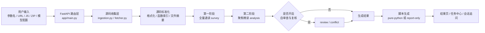

# TraceCipher AI

TraceCipher AI 是一个面向授权安全测试的本地 Web 工具，用于分析 Web 前端 JavaScript 中与指定参数相关的加密、编码、签名或混淆流程，并输出中文分析报告、函数调用链、关键材料和可执行 Python 脚本。

项目当前采用 `FastAPI + Jinja2` 本地启动方式，核心分析由大模型驱动，后端负责源码收集、上下文组织、任务调度、结构化结果校验、脚本生成和运行期数据持久化。

## 项目定位

这个项目不是通用浏览器自动化平台，也不是动态 JS 执行沙箱。当前更准确的定位是：

- 面向授权安全测试的前端参数链路分析工具
- 重点解决“某个参数到底是怎么在前端生成的”
- 对可逆流程尽量生成纯 Python 复现脚本
- 对不可逆签名、摘要、HMAC、token 等流程明确降级

## 当前能力

- 上传多个 `.js` 文件或 `.zip` 资源包进行分析
- 输入网页 URL，抓取当前页面直接引用的 JS，并补抓静态可发现的 chunk
- 支持额外填写外部 JS URL 列表
- 支持指定目标参数、参数位置、用途说明、接口上下文
- 由 LLM 主导输出分析结论，规则层只负责整理上下文与一致性检查
- 支持多任务、任务中心、进度条、暂停、删除、草稿重发
- 支持结果页继续追问，不必重新上传整套源码
- 输出中文分析结论、函数调用链、流程步骤、关键材料
- 对典型可逆流程尽量生成纯 Python 脚本
- 对可逆脚本支持在线输入密文并尝试解密

## 整体架构概览



## 端到端工作流程

项目一次完整分析可以概括为 5 步：

1. 创建任务：保存参数信息、源码输入和模型配置到 `data/runs/<run_id>/`
2. 收集源码：支持本地 `.js`、`.zip`、网页 URL 和外部 JS URL
3. 标准化源码：格式化源码并生成函数索引、文件摘要等上下文材料
4. 模型分析：先做 `survey` 全量通读，再做 `analysis` 聚焦精读；如开启自动复核，会继续执行 `review / conflict`
5. 生成产物：输出 `report.json`、可选 `replay.py`、调试日志和结果页展示

当前模型阶段可以简单理解为：

- `survey`：全量通读，找相关文件和重点函数
- `analysis`：聚焦精读，输出主结论和关键材料
- `review / conflict`：可选复核，处理字段冲突和结论不自洽
- `followup`：结果页继续追问，复用已有摘要和关键片段

## 技术实现说明

项目当前的技术实现可以概括为：

- Web 层：使用 `FastAPI + Jinja2` 做本地服务端渲染页面
- 任务层：使用 `asyncio.create_task(...)` 执行后台分析并把状态写回 `task.json`
- 抓取层：使用 `httpx + BeautifulSoup` 拉取网页和脚本资源，不执行目标站点 JS
- 分析层：采用“两阶段上下文”策略，先全量通读，再聚焦精读
- LLM 层：统一走 OpenAI-compatible `chat/completions`，对 `DeepSeek` 和 `GLM` 做兼容处理
- 结果层：对模型结果做归一化和一致性检查，再决定生成 `pure-python` 还是 `report-only`
- 存储层：不依赖数据库，所有任务、调试日志和模型配置都落盘到本地目录

运行期核心目录如下：

```text
data/runs/<run_id>/
  task.json
  request.json
  report.json
  sources/
  normalized/
  artifacts/
    replay.py
    llm_debug/

data/settings/
  llm_config.json
  llm_history.json
```

结果产物策略也比较简单：

- `pure-python`：关键材料稳定、可逆性明确时生成可运行 Python 脚本
- `report-only`：证据不足或结果冲突时只输出分析报告

为便于排查问题，每轮模型请求和响应都会落到 `artifacts/llm_debug/`。

## 项目目录说明

```text
app/
  main.py                    FastAPI 路由入口
  models.py                  数据模型
  services/
    analyzer.py              分析主流程编排
    llm.py                   模型调用、提示词和结构化解析
    ingestion.py             源码收集
    fetcher.py               网页与 JS 抓取
    script_generator.py      Python 产物生成与校验
    session_manager.py       结果页追问会话
    storage.py               本地持久化与任务文件操作
    task_manager.py          后台任务调度
templates/                   页面模板
static/                      页面样式
fixtures/                    本地测试样例
data/runs/                   任务结果与调试产物
data/settings/               模型配置与历史配置
requirements.txt             Python 依赖
Makefile                     启动快捷命令
```

## 环境要求

- Python `3.11+`
- macOS 或 Linux

## 克隆后快速启动

### 方式一：直接按 `pip` 启动

这是最通用的启动方式。其他人从 GitHub 下载项目后，按下面几步即可运行：

```bash
git clone <你的仓库地址>
cd js
python3 -m venv .venv
source .venv/bin/activate
pip install -r requirements.txt
uvicorn app.main:app --reload
```

启动后访问：

[http://127.0.0.1:8000](http://127.0.0.1:8000)

### 方式二：使用 Makefile

如果系统安装了 `make`，也可以执行：

```bash
make setup
make run
```

对应逻辑：

- `make setup`：创建虚拟环境并安装依赖
- `make run`：使用 `uvicorn app.main:app --reload` 启动

## 依赖安装说明

当前运行依赖都写在 `requirements.txt` 中，直接执行：

```bash
pip install -r requirements.txt
```

核心依赖包括：

- `fastapi`
- `uvicorn`
- `jinja2`
- `python-multipart`
- `httpx`
- `beautifulsoup4`
- `jsbeautifier`
- `pycryptodome`

其中需要注意：

- `pycryptodome` 安装后，代码里导入名是 `Crypto`
- 不需要额外单独安装名为 `Crypto` 的包

## 首次使用

1. 启动项目并打开 [http://127.0.0.1:8000](http://127.0.0.1:8000)
2. 在页面中配置模型接口
3. 选择上传 `.js` / `.zip`，或填写网页 URL
4. 输入目标参数名，例如 `password`、`sign`、`token`
5. 发起分析并在任务中心查看进度
6. 分析完成后进入结果页查看调用链、关键材料和脚本产物

## 使用边界

- 仅用于授权安全测试、自有系统分析或明确许可的研究场景
- 当前版本默认只做静态分析，不执行目标站点 JS
- 网页抓取模式不会模拟浏览器运行时环境，因此不保证拿到动态注入脚本
- “解密”能力仅在识别出可逆算法或可逆变换时成立
- 对签名、摘要、HMAC、不可逆 token 等流程，会明确标记为不可直接解密或证据不足

## 本地数据说明

以下内容属于运行期数据，不建议提交到 GitHub：

- `data/runs/`
- `data/settings/`
- `.venv/`

这些路径已经在 `.gitignore` 中忽略。

## GitHub 开源建议

建议在发布前至少确认下面几项：

1. 选择许可证  
   常见可选：`MIT`、`Apache-2.0`、`GPL-3.0`

2. 补充仓库描述  
   建议写清楚这是一个“AI 驱动的 JS 参数链路分析与脚本复现工具”

3. 写清合法使用边界  
   明确仅用于授权安全测试

4. 检查敏感信息  
   不要提交：
   - 真实 API Key
   - 本地模型配置
   - 运行任务结果
   - 临时调试文件

5. 补项目截图  
   最好在仓库首页补一张启动页或结果页截图

## 常见问题

### 1. 为什么必须配置大模型？

因为当前项目的主分析逻辑是由 LLM 完成的。规则层只做源码整理、上下文裁剪和结果一致性检查，不负责主结论判断。

### 2. 为什么结果有时只能生成报告？

因为模型虽然可能已经判断出大致流程，但还没有稳定恢复出可直接运行的纯 Python 脚本，或者关键材料存在冲突，这时会降级为 `report-only`。

### 3. 为什么在线解密有时不可用？

只有当结果被判定为可逆，且确实生成了稳定的 `pure-python` 脚本时，结果页才会开放在线解密。

### 4. 为什么有时分析会比较慢？

因为当前流程不是“调用一次模型就结束”，而是可能经历：

- 第一阶段全量通读
- 第二阶段聚焦精读
- 模型自审查
- 关键材料一致性复核

如果结果第一次没有收敛，就会触发后两轮，因此总耗时会上升。

### 5. 默认模型配置保存在哪里？

默认模型配置和历史配置保存在：

- `data/settings/`

这些文件只用于本地运行，不建议提交到仓库。
