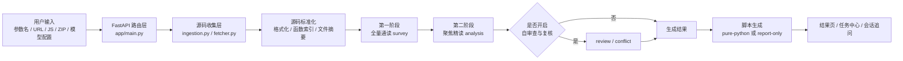

# TraceCipher AI

TraceCipher AI 是一个面向授权安全测试的本地 Web 工具，用于分析 Web 前端 JavaScript 中与指定参数相关的加密、编码、签名或混淆流程，并输出中文分析报告、函数调用链、关键材料和可执行 Python 脚本。

项目当前采用 `FastAPI + Jinja2` 本地启动方式，核心分析由大模型驱动，后端负责源码收集、上下文组织、任务调度、结构化结果校验、脚本生成和运行期数据持久化。

## 项目定位

这个项目不是通用浏览器自动化平台，也不是动态 JS 执行沙箱。当前更准确的定位是：

- 面向授权安全测试的前端参数链路分析工具
- 重点解决“某个参数到底是怎么在前端生成的”
- 对可逆流程尽量生成纯 Python 复现脚本
- 对不可逆签名、摘要、HMAC、token 等流程明确降级

## 当前能力

- 上传多个 `.js` 文件或 `.zip` 资源包进行分析
- 输入网页 URL，抓取当前页面直接引用的 JS，并补抓静态可发现的 chunk
- 支持额外填写外部 JS URL 列表
- 支持指定目标参数、参数位置、用途说明、接口上下文
- 由 LLM 主导输出分析结论，规则层只负责整理上下文与一致性检查
- 支持多任务、任务中心、进度条、暂停、删除、草稿重发
- 支持结果页继续追问，不必重新上传整套源码
- 输出中文分析结论、函数调用链、流程步骤、关键材料
- 对典型可逆流程尽量生成纯 Python 脚本
- 对可逆脚本支持在线输入密文并尝试解密

## 整体架构概览



## 端到端工作流程

项目一次完整分析大致分为 8 步。

### 1. 创建任务

用户在页面中提交：

- 参数名，例如 `password`、`sign`、`token`
- 参数类型和位置
- 可选参数用途说明或接口上下文
- JS 文件、ZIP 包、网页 URL 或外部 JS URL
- 模型配置

后端入口在 `app/main.py`，会先创建 `data/runs/<run_id>/` 任务目录，并保存：

- `task.json`
- `request.json`
- 后续所有源码、调试信息、报告和脚本产物

### 2. 收集源码

源码收集逻辑在 `app/services/ingestion.py`。

支持三类输入：

- 本地上传的 `.js`
- 本地上传的 `.zip`
- 网页 URL / 外部 JS URL

其中网页抓取逻辑在 `app/services/fetcher.py`，当前策略是：

- 抓取 HTML 中直接引用的 `<script src>`
- 下载这些 JS
- 再从直接脚本中静态搜索可能的 chunk URL
- 不模拟浏览器运行时环境
- 不执行目标网页 JS

这一步结束后，所有源码会写入：

- `data/runs/<run_id>/sources/`

### 3. 标准化源码

分析开始前，会对源码做一次标准化处理，逻辑在 `app/services/analyzer.py`：

- 优先使用 `jsbeautifier` 做格式化
- 保留原始文件副本
- 写入格式化后的副本到 `normalized/`
- 为后续模型分析生成：
  - 函数索引
  - 内容标记
  - 文件摘要

这里的标记只用于帮助整理上下文，不直接代替模型判断。

### 4. 第一阶段全量通读

这是模型分析的第一阶段，逻辑在 `app/services/analyzer.py` 和 `app/services/llm.py`。

目标不是直接下最终结论，而是：

- 通读全部源码
- 识别相关文件
- 找出重点函数
- 找出参数相关函数链
- 给第二阶段提供精读线索

这一阶段当前输出为“固定中文小节”，不是严格 JSON。原因是：

- 第一阶段更适合做全局理解
- 不需要一上来就输出完整脚本结论
- 可以减少结构化 JSON 对模型的额外压力

### 5. 第二阶段聚焦精读

第二阶段会基于第一阶段的全量理解，重新组织上下文，只保留：

- 重点函数片段
- 重点文件摘录
- 参数相关上下文
- 第一阶段给出的聚焦目标

然后交给模型做最终主分析。

这里输出的是严格结构化 JSON，主要字段包括：

- `summary`
- `observed_facts`
- `inferred_operations`
- `function_chain`
- `key_material`
- `reversibility`
- `preferred_script_type`

当前的提示词策略不是“直接让模型猜结论”，而是：

1. 先提取代码事实
2. 再根据事实归纳操作链和函数链
3. 再判断可逆性和脚本类型

这一层是当前项目稳定性的核心。

### 6. 模型自审查与冲突复核

主分析完成后，后端不会直接无条件相信结果。

如果开启了“模型自审查与复核”，系统会继续做两层检查：

#### 第一层：自审查

检查例如：

- 明明是简单可逆变换，却没有输出 `pure-python`
- 判断为可逆，但脚本类型不自洽
- 涉及 AES 时，`key` 或 `iv` 长度不合法
- 可逆流程却没有函数链

#### 第二层：关键材料一致性复核

如果模型仍然说“可逆 + pure-python”，但关键材料仍不合法，会继续复核：

- 是否真的拿到了最终参与运算的值
- 关键材料和脚本类型是否一致
- 是否应该降级成 `report-only`

这一部分的实现位于：

- `app/services/analyzer.py`
- `app/services/llm.py`

并且现在已经支持用户在页面里手动开关。

### 7. 生成 Python 产物

产物生成逻辑在 `app/services/script_generator.py`。

当前只保留两种产物类型：

- `pure-python`
- `report-only`

不再使用 `Node bridge`。

生成策略大致是：

- 如果模型明确识别出 AES 且关键材料合法，则生成 AES 纯 Python 脚本
- 如果模型识别出的是 `base64 / urlencode / json / hex` 等可逆操作链，则生成对应的纯 Python 复现脚本
- 如果关键材料不稳定、操作链不清晰或结论自相矛盾，则降级为 `report-only`

### 8. 校验、落盘与结果展示

如果用户提供了明文/密文样本，系统会尝试自动校验：

- 是否能复现同样的加密结果
- 是否能在可逆场景下完成反向解密

所有结果会落盘到任务目录，包括：

- `report.json`
- `artifacts/replay.py`
- `artifacts/llm_debug/*.json`

结果页展示：

- 分析是否成功
- 参数加密总结
- 核心操作链
- 函数调用链
- 关键材料
- 可逆性
- 是否支持在线解密
- 原始 LLM 调试产物链接

## 模型阶段说明

项目里的模型分析不是单轮问答，而是按阶段推进。不同阶段的目标不同，因此耗时和输出格式也不同。

### `survey`

第一阶段，全量通读源码，建立全局理解。

主要任务：

- 识别最相关的文件
- 找出最值得精读的函数或代码片段
- 提炼参数相关调用链线索
- 为第二阶段生成聚焦范围

当前这一阶段不再强制严格 JSON，而是要求模型按固定中文小节输出，随后由工具内部解析成结构化概览。

### `analysis`

第二阶段，基于第一阶段筛出的重点上下文做最终主分析。

主要任务：

- 提取代码事实
- 归纳操作链和函数链
- 提取关键材料
- 判断可逆性
- 判断是否可以生成 `pure-python`

这一阶段是最核心的一轮，结果页里的主要结论基本来自这里。

### `review`

可选阶段，仅在开启“模型自审查与复核”后触发。

主要任务：

- 检查主分析结果是否自洽
- 重新核对代码事实
- 修正操作链、函数链、关键材料和结论之间的明显冲突

### `conflict`

可选阶段，仅在 `review` 后仍存在关键冲突时触发。

主要任务：

- 专门处理关键材料与结论之间的矛盾
- 判断是否应该维持 `pure-python`
- 若证据不足则降级为 `report-only`

### `followup`

结果页继续追问阶段。

这一阶段不会重新上传整套源码，而是复用：

- 首轮分析摘要
- 关键源码片段
- 函数链、操作链、关键材料
- 最近几轮会话内容

因此它更像是在已有分析结果上的补充提问，而不是重新跑整套任务。

## 技术实现说明

### 1. Web 层

项目当前不是前后端分离 SPA，而是传统服务端渲染：

- `FastAPI` 负责路由、文件上传、任务接口和结果接口
- `Jinja2` 负责页面模板
- `static/style.css` 负责样式

优点是：

- 启动简单
- 本地使用成本低
- 任务状态和结果页开发更快

### 2. 异步任务层

任务调度在 `app/services/task_manager.py`。

实现方式是：

- 使用 `asyncio.create_task(...)` 启动后台分析任务
- 任务状态写回 `task.json`
- 任务中心轮询查看进度
- 支持暂停任务

当前没有引入 Celery、Redis 或消息队列，定位就是本地单机工具。

### 3. 源码抓取层

源码抓取使用：

- `httpx` 负责 HTTP 拉取
- `BeautifulSoup` 解析 HTML

网页抓取边界是：

- 只抓页面直接引用 JS
- 再从脚本正文静态发现 chunk URL
- 不模拟浏览器环境
- 不执行动态注入代码

### 4. 上下文组织层

这个项目真正的实现重点，不在“调用一下 LLM API”，而在“怎么组织模型上下文”。

当前策略是两阶段：

- 第一阶段：全量通读，建立全局理解
- 第二阶段：聚焦精读，只喂重点片段

这样做是因为直接把所有源码每次都全量丢给模型，成本高且稳定性差。

### 5. LLM 调用层

LLM 调用逻辑在 `app/services/llm.py`。

目前支持：

- `DeepSeek`
- `GLM`

实现方式是：

- 统一走 OpenAI-compatible `chat/completions`
- 对不同供应商做 payload 差异处理
- 内置重试、超时、请求调试落盘
- 保存每轮请求与响应到 `artifacts/llm_debug/`

这层还负责：

- 默认提示词
- 阶段性 prompt 构造
- 结构化结果解析
- 对部分接口兼容问题做降级回退

这层还实现了几个和稳定性直接相关的机制：

- 分阶段 `max_tokens` 控制
- 按供应商差异调整 payload
- 超时、断连、空正文等异常的自动重试
- 调试请求和响应的本地落盘

### 6. 结构化输出与归一化

模型不是直接把结果原样塞到页面里。

当前流程是：

- 模型返回结构化结果
- 后端做字段归一化
- 对关键字段做校验
- 再交给后续脚本生成、结果展示和解密逻辑

归一化主要处理：

- `reversibility`
- `preferred_script_type`
- `inferred_operations`
- `function_chain`
- `observed_facts`
- `key_material`

### 7. 脚本生成层

脚本生成层的目标不是“100% 还原目标 JS 语义”，而是：

- 在模型已经提取出足够稳定事实时
- 优先生成可运行的纯 Python 脚本

当前更适合：

- AES-CBC / AES-ECB
- Base64
- URL 编码
- JSON
- Hex

如果证据不够，不会强行生成脚本。

### 8. 本地持久化

项目没有数据库，当前主要依赖文件系统保存状态。

运行期核心目录：

```text
data/runs/<run_id>/
  task.json
  request.json
  report.json
  sources/
  normalized/
  artifacts/
    replay.py
    llm_debug/

data/settings/
  llm_config.json
  llm_history.json
```

这种实现方式的优点是：

- 易读
- 易调试
- 易清理
- 本地开箱即用

## 结果判定与产物策略

当前项目不会把所有分析结果都强行生成为脚本，而是按证据强度分层：

### `pure-python`

满足以下条件时优先生成：

- 代码事实足够稳定
- 操作链清晰
- 关键材料明确
- 可逆性明确

典型适用：

- `AES-CBC / AES-ECB`
- `Base64`
- `URL 编码`
- `JSON`
- `Hex`

### `report-only`

以下情况会降级为仅报告：

- 关键材料不稳定
- 模型结论自相矛盾
- 无法可靠判断是否可逆
- 虽然看出大致流程，但不足以生成稳定脚本

这个策略的核心思想是：

- 宁可少给脚本
- 也不输出误导性的“假可执行结果”

## 调试与可观测性

为了方便排查“为什么这次慢”“为什么这次没收敛”“为什么某一轮失败”，项目会把每轮模型调用的调试信息写到任务目录。

常见文件包括：

- `artifacts/llm_debug/*_request.json`
- `artifacts/llm_debug/*_response.json`
- `artifacts/llm_debug/*_meta.json`
- `artifacts/llm_debug/*_timeout.json`
- `artifacts/llm_debug/*_parsed_result.json`

这些文件可以帮助你定位：

- 实际发给模型的 prompt 有多长
- 某一轮使用了多少 `max_tokens`
- 是哪一轮超时、断连、空正文或 JSON 解析失败
- 是 `survey`、`analysis`、`review` 还是 `conflict` 在拖慢任务

## 项目目录说明

```text
app/
  main.py                    FastAPI 路由入口
  models.py                  数据模型
  services/
    analyzer.py              分析主流程编排
    llm.py                   模型调用、提示词和结构化解析
    ingestion.py             源码收集
    fetcher.py               网页与 JS 抓取
    script_generator.py      Python 产物生成与校验
    session_manager.py       结果页追问会话
    storage.py               本地持久化与任务文件操作
    task_manager.py          后台任务调度
templates/                   页面模板
static/                      页面样式
fixtures/                    本地测试样例
data/runs/                   任务结果与调试产物
data/settings/               模型配置与历史配置
requirements.txt             Python 依赖
Makefile                     启动快捷命令
```

## 环境要求

- Python `3.11+`
- macOS 或 Linux

## 克隆后快速启动

### 方式一：直接按 `pip` 启动

这是最通用的启动方式。其他人从 GitHub 下载项目后，按下面几步即可运行：

```bash
git clone <你的仓库地址>
cd js
python3 -m venv .venv
source .venv/bin/activate
pip install -r requirements.txt
uvicorn app.main:app --reload
```

启动后访问：

[http://127.0.0.1:8000](http://127.0.0.1:8000)

### 方式二：使用 Makefile

如果系统安装了 `make`，也可以执行：

```bash
make setup
make run
```

对应逻辑：

- `make setup`：创建虚拟环境并安装依赖
- `make run`：使用 `uvicorn app.main:app --reload` 启动

## 依赖安装说明

当前运行依赖都写在 `requirements.txt` 中，直接执行：

```bash
pip install -r requirements.txt
```

核心依赖包括：

- `fastapi`
- `uvicorn`
- `jinja2`
- `python-multipart`
- `httpx`
- `beautifulsoup4`
- `jsbeautifier`
- `pycryptodome`

其中需要注意：

- `pycryptodome` 安装后，代码里导入名是 `Crypto`
- 不需要额外单独安装名为 `Crypto` 的包

## 首次使用

1. 启动项目并打开 [http://127.0.0.1:8000](http://127.0.0.1:8000)
2. 在页面中配置模型接口
3. 选择上传 `.js` / `.zip`，或填写网页 URL
4. 输入目标参数名，例如 `password`、`sign`、`token`
5. 发起分析并在任务中心查看进度
6. 分析完成后进入结果页查看调用链、关键材料和脚本产物

## 使用边界

- 仅用于授权安全测试、自有系统分析或明确许可的研究场景
- 当前版本默认只做静态分析，不执行目标站点 JS
- 网页抓取模式不会模拟浏览器运行时环境，因此不保证拿到动态注入脚本
- “解密”能力仅在识别出可逆算法或可逆变换时成立
- 对签名、摘要、HMAC、不可逆 token 等流程，会明确标记为不可直接解密或证据不足

## 本地数据说明

以下内容属于运行期数据，不建议提交到 GitHub：

- `data/runs/`
- `data/settings/`
- `.venv/`

这些路径已经在 `.gitignore` 中忽略。

## GitHub 开源建议

建议在发布前至少确认下面几项：

1. 选择许可证  
   常见可选：`MIT`、`Apache-2.0`、`GPL-3.0`

2. 补充仓库描述  
   建议写清楚这是一个“AI 驱动的 JS 参数链路分析与脚本复现工具”

3. 写清合法使用边界  
   明确仅用于授权安全测试

4. 检查敏感信息  
   不要提交：
   - 真实 API Key
   - 本地模型配置
   - 运行任务结果
   - 临时调试文件

5. 补项目截图  
   最好在仓库首页补一张启动页或结果页截图

## 常见问题

### 1. 为什么必须配置大模型？

因为当前项目的主分析逻辑是由 LLM 完成的。规则层只做源码整理、上下文裁剪和结果一致性检查，不负责主结论判断。

### 2. 为什么结果有时只能生成报告？

因为模型虽然可能已经判断出大致流程，但还没有稳定恢复出可直接运行的纯 Python 脚本，或者关键材料存在冲突，这时会降级为 `report-only`。

### 3. 为什么在线解密有时不可用？

只有当结果被判定为可逆，且确实生成了稳定的 `pure-python` 脚本时，结果页才会开放在线解密。

### 4. 为什么有时分析会比较慢？

因为当前流程不是“调用一次模型就结束”，而是可能经历：

- 第一阶段全量通读
- 第二阶段聚焦精读
- 模型自审查
- 关键材料一致性复核

如果结果第一次没有收敛，就会触发后两轮，因此总耗时会上升。

### 5. 默认模型配置保存在哪里？

默认模型配置和历史配置保存在：

- `data/settings/`

这些文件只用于本地运行，不建议提交到仓库。
